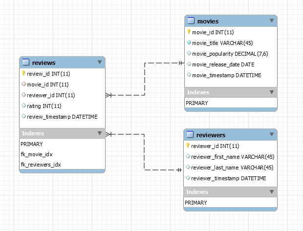

```{r setup, include=FALSE}
knitr::opts_chunk$set(echo = TRUE)
```
## Intro

For this assignment I decided to create a relational database and populate it on the fly. Movies were loaded using https://www.themoviedb.org API.
I used the *randomNames* package to create reviewers. I then made the reviewers rate each movie with a random value from 1 to 5. The ratings were then loaded into R for basic analysis.
<br />

## Load Packages

```{r}
library("httr")
library("DBI")
library("RMySQL")
library("randomNames")
library("tidyverse")
```
<br />

## My Schema




## Connect to Database
```{r}
rmysql.settingsfile <- "config/mylogin.cnf"
rmysql.db <- "movies"
con <- dbConnect(MySQL(), default.file = rmysql.settingsfile, group = rmysql.db, user = NULL, password = NULL)
dbListTables(con)
```
<br />

## Get Movies
```{r}
  link <- "https://api.themoviedb.org/3/discover/movie?api_key=53b3abb279c64aa6b8bd31cedf177293&language=en-US&include_adult=false&primary_release_year=2017&sort_by=vote_average.desc"
  num_movies <- 6
  request_movies <- GET(link)
  request_movies$status_code
 
  my_movies <- content(request_movies, "parsed")
  movies <- my_movies$results
 
  if(length(my_movies$results) < num_movies){
    message("Movies not available. I suggest using the movies database as is.")
  } else {
    #Clear the movies table in preparation to new inserts
    oldMovies <- dbGetQuery(con, "SELECT group_concat(movies.movie_id SEPARATOR ',') AS listing, 
                                  Count(*) AS num_rows FROM movies")
  
  if(oldMovies$num_rows[1] > 0){
    ds <- dbSendQuery(con, sprintf("DELETE FROM movies WHERE movies.movie_id IN (%s)",oldMovies[1]$listing))
    dbClearResult(ds)
  }
    a <- 1
    while(a <= num_movies){
      sql <- sprintf("INSERT INTO movies SET 
                      movie_id=%d, 
                      movie_title='%s', 
                      movie_popularity='%s', 
                      movie_release_date='%s' 
                      ON DUPLICATE KEY UPDATE movie_id='%s'", 
                      movies[[a]]$id, movies[[a]]$title, movies[[a]]$popularity, movies[[a]]$release_date, movies[[a]]$id)
      
      rs <- dbSendQuery(con, sql)
      dbClearResult(rs)
      a <- a + 1
    }
  }

```
<br />

## Generate Some Imaginary Friends


```{r}
num_friends = 10
new_friends <- randomNames(num_friends)
  # Clear the friends table in preparation to new friends
  oldFriends <- dbGetQuery(con, "SELECT group_concat(reviewers.reviewer_id SEPARATOR ',') AS listing, 
                                Count(*) AS num_rows FROM reviewers")
  
  if(oldFriends$num_rows[1] > 0){
    ds <- dbSendQuery(con, sprintf("DELETE FROM reviewers WHERE reviewers.reviewer_id IN (%s)", oldFriends[1]$listing))
    dbClearResult(ds)
  }
 
  a <- 1
  while(a <= num_friends){
    new_friend = strsplit(new_friends[[a]],",")
    sql <- sprintf("INSERT INTO reviewers SET 
                    reviewer_id=%d,
                    reviewer_first_name='%s', 
                    reviewer_last_name='%s'  
                    ON DUPLICATE KEY UPDATE   reviewer_first_name='%s', reviewer_last_name='%s'", 
                    a, new_friend[[1]][1], new_friend[[1]][2],new_friend[[1]][1], new_friend[[1]][2])
    
    rs <- dbSendQuery(con, sql)
    dbClearResult(rs)
    a <- a + 1
  }

```
<br />

## Let Them Vote
```{r}
 # Remove old reviews
 oldReviews <- dbGetQuery(con, "SELECT group_concat(reviews.review_id SEPARATOR ',') AS listing, 
                                Count(*) AS num_rows FROM reviews")
  if(oldReviews$num_rows[1] > 0){
    ds <- dbSendQuery(con, sprintf("DELETE FROM reviews WHERE reviews.review_id IN (%s)", oldReviews[1]$listing))
    dbClearResult(ds)
  }

theMovies <- dbGetQuery(con, sprintf("SELECT movie_id FROM movies LIMIT %d", num_movies))
theReviewers <- dbGetQuery(con, sprintf("SELECT reviewer_id FROM reviewers LIMIT %d", num_friends))

for(r in 1:nrow(theReviewers) ){
  for(m in 1:nrow(theMovies)){
    rating <- floor(runif(1,1,6))
    sql <- sprintf("INSERT INTO reviews SET 
                    movie_id=%d, 
                    reviewer_id=%d, 
                    rating=%d  
                    ON DUPLICATE KEY UPDATE movie_id=%d, reviewer_id=%d, rating=%d", 
                    theMovies$movie_id[m], theReviewers$reviewer_id[r], rating, theMovies$movie_id[m], theReviewers$reviewer_id[r], rating)
    rs <- dbSendQuery(con, sql)
    dbClearResult(rs)
  }
}
```
<br />

## Load All Reviews
```{r}
sql <- "SELECT movies.movie_title AS Movie,
        reviews.rating AS Rating, 
        CONCAT(reviewers.reviewer_first_name,' ',reviewers.reviewer_last_name) AS Reviewer
        FROM reviews 
        INNER JOIN movies ON (movies.movie_id = reviews.movie_id)
        INNER JOIN  reviewers ON (reviewers.reviewer_id = reviews.reviewer_id)"

theReviews <- suppressWarnings(dbGetQuery(con, sql))

print(theReviews)
```
<br />

## Reviews by Movie
```{r}
sql <- "SELECT movies.movie_title AS Movie,
        movies.movie_release_date AS 'Release Date',
        AVG(reviews.rating) As Average_Rating
        FROM reviews 
        INNER JOIN movies ON (movies.movie_id = reviews.movie_id)
        GROUP BY reviews.movie_id"

theReviews <- suppressWarnings(dbGetQuery(con, sql))

print(theReviews)
```
<br />

1. Which movie got the most love?

```{r}
highestRated <- theReviews[which.max(theReviews$Average_Rating),]
print(highestRated)
```
<br />

2. Which movie got the least love?

```{r}
sql <- "SELECT movies.movie_title AS Movie,
        movies.movie_release_date AS 'Release Date',
        AVG(reviews.rating) As Average_Rating
        FROM reviews 
        INNER JOIN movies ON (movies.movie_id = reviews.movie_id)
        GROUP BY reviews.movie_id
        ORDER BY Average_Rating ASC LIMIT 1"

leastLove <- suppressWarnings(dbGetQuery(con, sql))

print(leastLove)
```
<br />

## Reviews by Reviewer

```{r}
sql <- "SELECT CONCAT(reviewers.reviewer_first_name,' ', reviewers.reviewer_last_name) AS Reviewer,
        AVG(reviews.rating) AS Average_Rating
        FROM reviews 
        INNER JOIN reviewers ON (reviewers.reviewer_id = reviews.reviewer_id)
        GROUP BY reviews.reviewer_id"

theReviewers <- suppressWarnings(dbGetQuery(con, sql))
print(theReviewers)
```
<br />

3. Which reviewer gave the most love?

```{r}
highestRater <- theReviewers[which.max(theReviewers$Average_Rating),]
print(highestRater)
```
<br />

4. Which reviewer gave the least love?

```{r}
lowestRater <- theReviewers[which.min(theReviewers$Average_Rating),]
print(lowestRater)
```
<br />

##  Summary Plot

```{r}
sql <- "SELECT movies.movie_title AS Movie,
        reviews.rating AS Rating,
        count(rating) as Counts  from reviews
        INNER JOIN movies ON (movies.movie_id = reviews.movie_id)
        GROUP BY reviews.movie_id,reviews.rating"

theRatings <- suppressWarnings(dbGetQuery(con, sql))
theRatings$Rating <- factor(theRatings$Rating, levels = c("One"<-1, "Two"<-2, "Three"<-3, "Four"<-4,"Five"<-5))

ggplot(data = theRatings, aes(x = Movie, y = Counts, fill = Rating)) + geom_bar(stat = "identity") + coord_flip() + scale_fill_brewer(palette = 12) + labs(title = "Distribution of Ratings Per Movie")

```